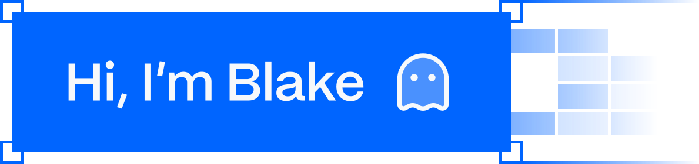
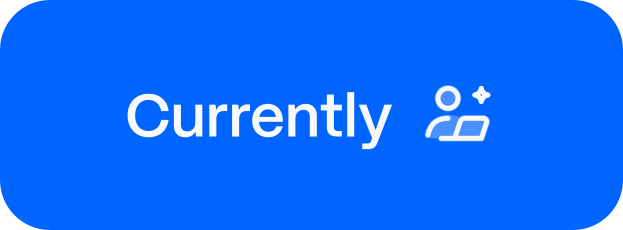
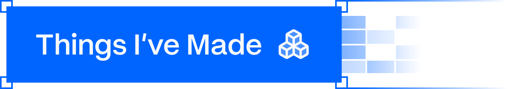
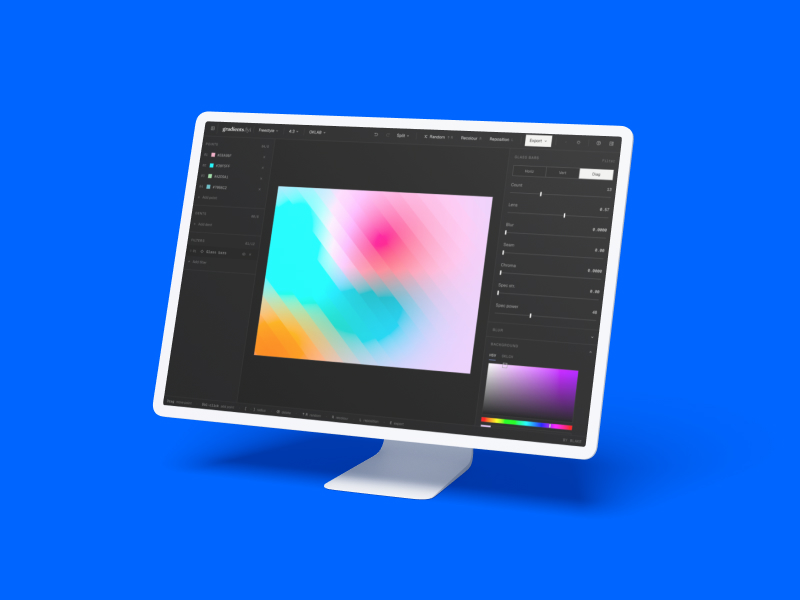
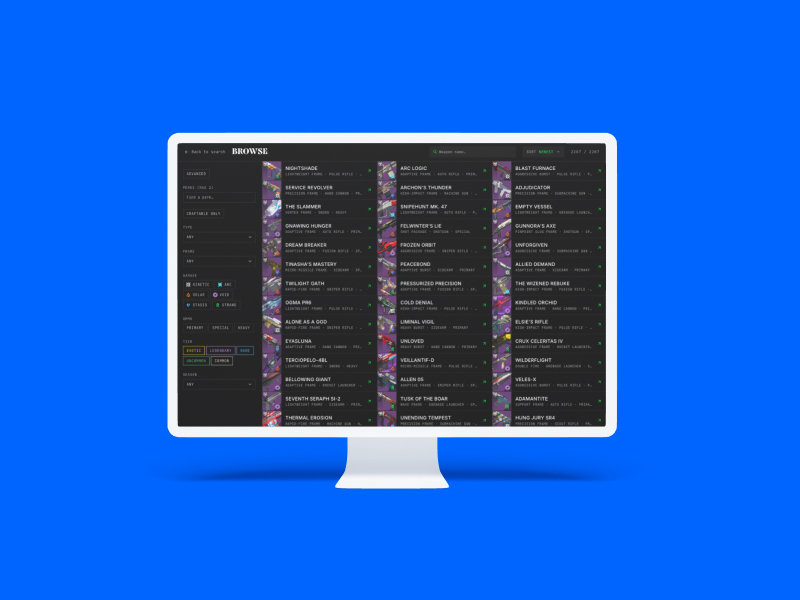
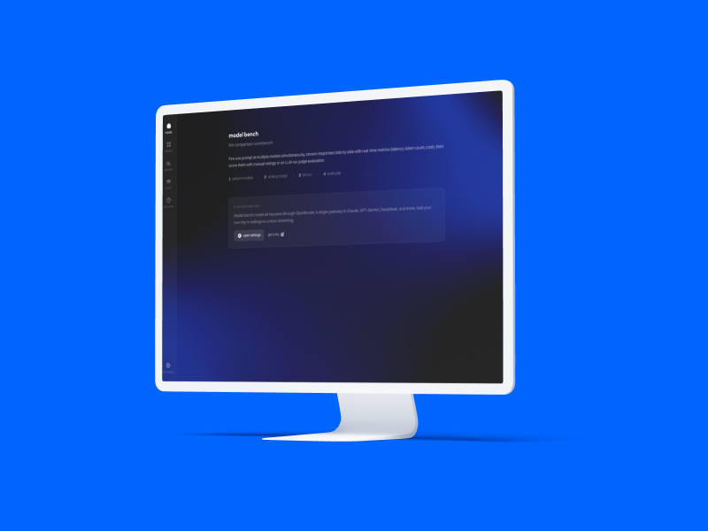
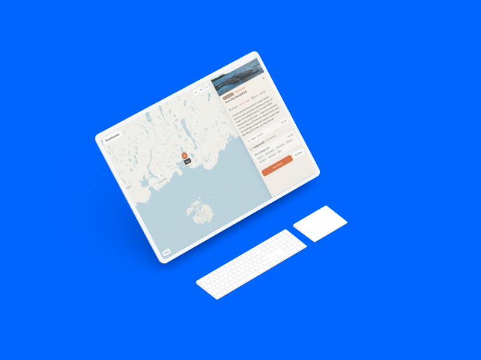
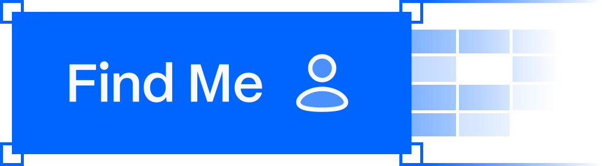

Product engineer. I design the thing, build the front of it, then wire up the back.
Mostly I just like watching an idea turn into something you can actually open.

 

Full-time at **[Avatone](https://avatone.co)**, a gamified fitness app. I touch most of
it: design, frontend, backend, branding, the odd pitch deck. We're past 40,000 people in
early access, and the silly little avatars are the bit people fall for first.

 

<table>
  <tr>
    <td width="50%" valign="top">
      
       <b>gradients.fyi</b> · a free OKLCH mesh-gradient editor. Grain, blur, dither, and no subscription for a blurry blob.
    </td>
    <td width="50%" valign="top">
      
       <b>d2ttk</b> · a Destiny 2 weapon database and time-to-kill calculator. Share an exact roll as a link.
    </td>
  </tr>
  <tr>
    <td width="50%" valign="top">
      
       <b>Model Bench</b> · run one prompt across a stack of LLMs, then let an AI judge score them blind.
    </td>
    <td width="50%" valign="top">
      
       <b>Woodsmoke</b> · a camping planner for Canadian parks. Weather, fire risk, bear country, one map.
    </td>
  </tr>
</table>

 

**Design** Figma, Paper
**Build** Next, React, Astro, Flutter
**Backend** Supabase, Pocketbase
**Plus** Tauri, and the occasional Unity detour

 

The good stuff lives at **[cyze.dev](https://cyze.dev)**. Got an idea and think I could help?
Reach out, I read all of it.
